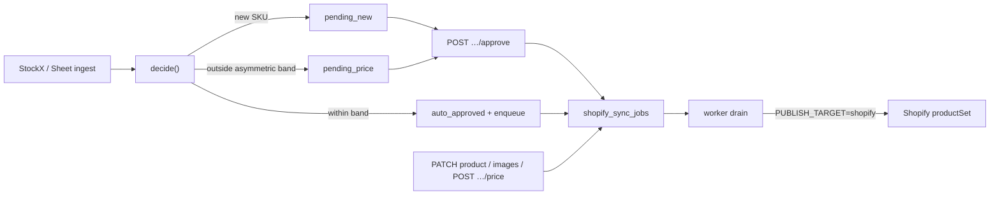
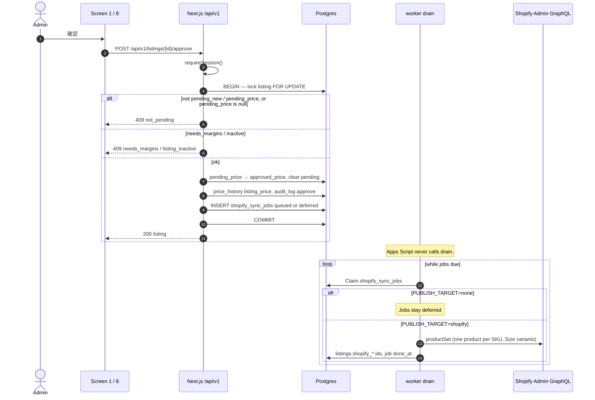
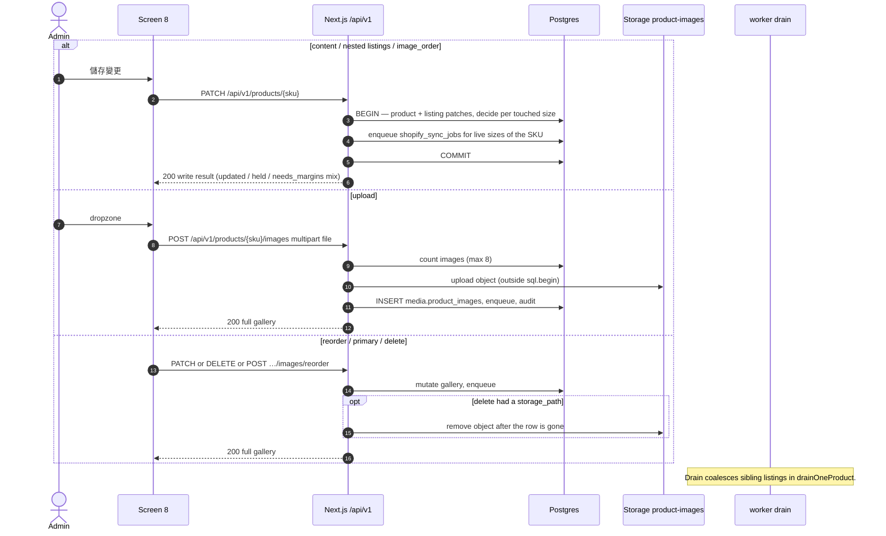
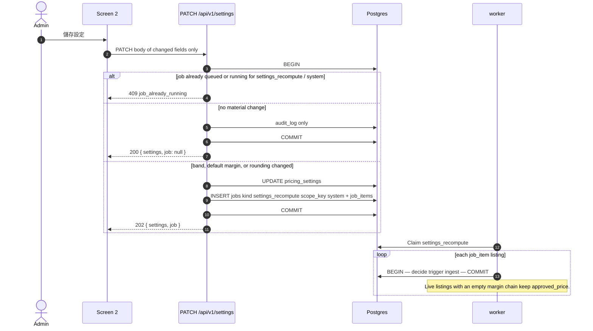
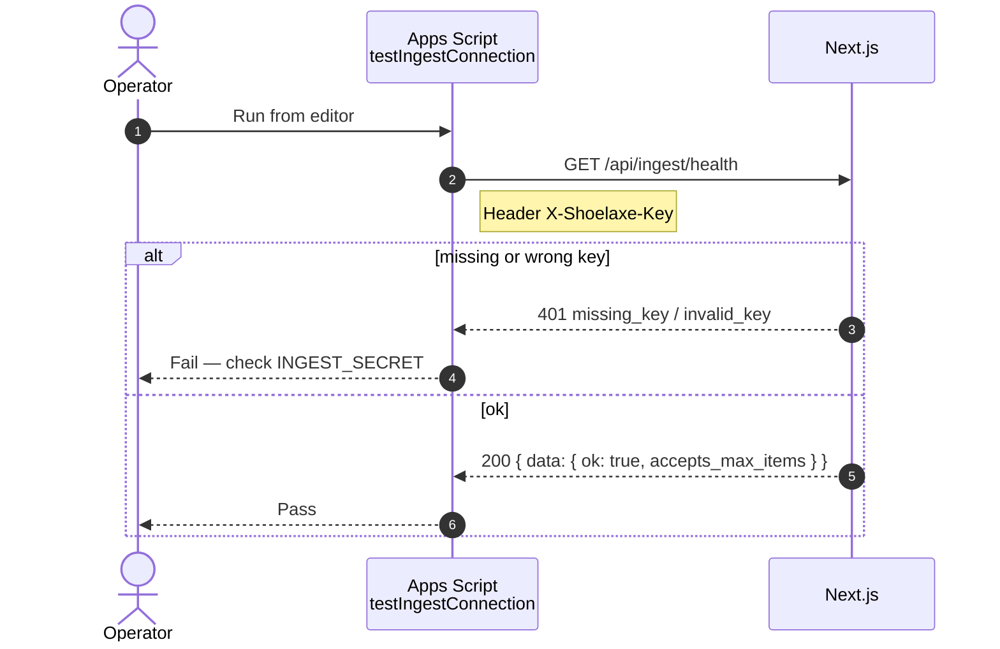
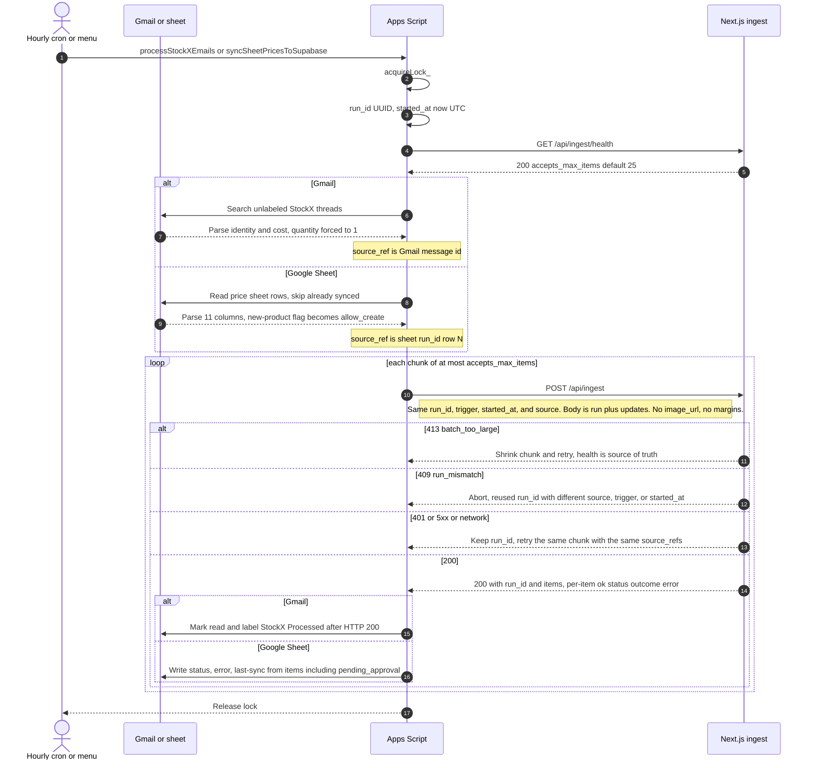
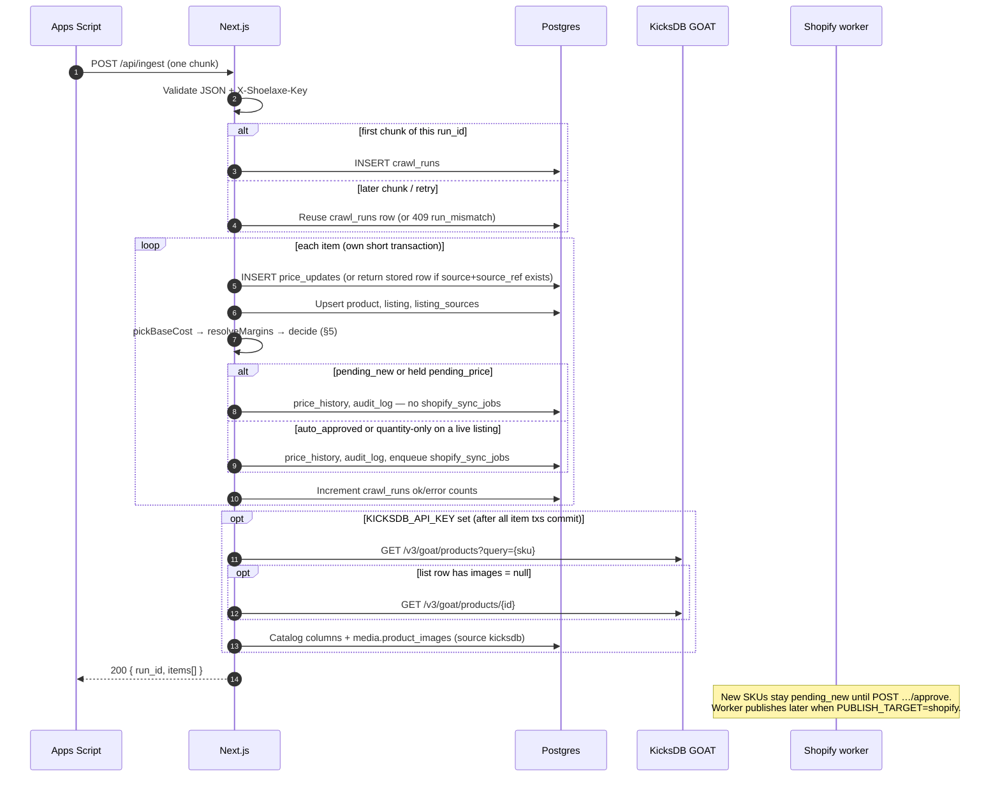

# Shoelaxe Dashboard — Internal API Reference

Narrative documentation for every HTTP surface the dashboard and ingest pipeline call. The
machine-readable spec lives in [`docs/openapi.json`](openapi.json), generated from the same Zod
schemas the route handlers will validate with — **do not edit the JSON by hand**.

```
lib/schemas/wire/** + lib/schemas/params/** + lib/api/contract/**
  → pnpm contract
  → docs/openapi.json
  → lib/api/schema.d.ts
```

**Current status (2026-09):** `docs/openapi.json` has 46 operations. The machine ingest and Shopify
drain/sync routes were never provisional. The **dashboard write loop** has landed as real
`defineRoute` handlers (session auth, Postgres, enqueue-not-inline Shopify). Remaining `/api/v1`
operations are still **provisional** (`x-provisional: true`) and served by MSW when
`NEXT_PUBLIC_API_MOCKS` is on.

When a real route lands, its matching entry is deleted from `PROVISIONAL` in `lib/api/contract/**`
in the same commit and `pnpm contract` is re-run. MSW still looks up every operation (landed or
not) from `CONTRACT_DOCS`.

**Landed dashboard operations**

| Method | Path |
|---|---|
| `GET` | `/api/v1/approvals`, `/api/v1/approvals/stats` |
| `GET`, `PATCH` | `/api/v1/products/{sku}` |
| `POST` | `/api/v1/products/{sku}/images` |
| `PATCH`, `DELETE` | `/api/v1/products/{sku}/images/{image_id}` |
| `POST` | `/api/v1/products/{sku}/images/reorder` |
| `POST` | `/api/v1/listings/{id}/approve`, `/reject`, `/price` |
| `POST` | `/api/v1/listings/bulk-approve` |
| `GET`, `PATCH` | `/api/v1/settings` |

Shopify is **never** called inside `sql.begin()`. “Immediately” on a dashboard write means: commit
to Supabase, enqueue `shopify_sync_jobs`. The worker / `POST /api/shopify/drain` publishes when
`PUBLISH_TARGET=shopify`. With the default `PUBLISH_TARGET=none` (including `pnpm dev`), jobs stay
`deferred`.

---

## Table of contents

1. [Overview](#overview)
2. [Authentication](#authentication)
3. [Response envelope](#response-envelope)
4. [Conventions](#conventions)
5. [Error codes](#error-codes)
6. [Domain vocabulary](#domain-vocabulary)
7. [Auth & session](#auth--session)
8. [Approvals](#approvals)
9. [Products](#products)
10. [Listings (sizes)](#listings-sizes)
11. [Groups](#groups)
12. [Jobs & system health](#jobs--system-health)
13. [Settings & users](#settings--users)
14. [Crawl status](#crawl-status)
15. [Dashboard write loop](#dashboard-write-loop)
16. [Apps Script ingest sequence](#apps-script-ingest-sequence)
17. [Machine routes](#machine-routes)
18. [Shopify publishing routes](#shopify-publishing-routes)
19. [Side effects](#side-effects)
20. [Pricing decision](#pricing-decision-5-summary)

---

## Overview

| Property | Value |
|---|---|
| Dashboard API base | `/api/v1` |
| Machine ingest base | `/api/ingest` (not under `/v1`) — [Apps Script sequence](#apps-script-ingest-sequence) |
| Content type | `application/json` unless noted |
| Currency | HKD only (stored and transmitted as numeric strings) |
| Timestamps | RFC 3339 with offset, stored UTC, displayed `Asia/Hong_Kong` |
| Pagination | Offset-based (`page`, `per_page`); options **20 / 50 / 100**, default **20** |
| Multi-value filters | Comma-joined strings (e.g. `status=within_band,pending_new`) |

Landed dashboard endpoints require a session when Supabase public env is configured (see
[Authentication](#authentication)). Every mutation writes an `audit_log` row.

---

## Authentication

### Dashboard (session)

Supabase Auth with Google provider. Landed `/api/v1` routes use `auth: "session"` in `defineRoute`,
which calls `requireSession()`:

| Condition | Result |
|---|---|
| Public Supabase env unset (local mock / no cookies) | Anonymous actor `label: "dashboard"` — not gated |
| Env set, no cookie / no user | `unauthenticated` (401) |
| Auth client error | `session_expired` (401) |
| Valid Google session | Actor is the user's id, email, and display name |

The `allowed_users` allow-list is **not yet enforced** on these routes (M6). Until then any valid
Google session is enough. `not_allowed` remains in the closed error lists so the UI copy exists.

| Mechanism | Detail |
|---|---|
| Transport | HTTP-only cookies set by Supabase (`sb-access-token`, etc.) |
| OpenAPI security scheme | `session` (cookie) |
| Authorization model | Single role — any signed-in user can approve prices and manage settings |

Browser login flow:

1. User signs in via Google on `/login`.
2. Supabase redirects to `GET /auth/callback?code=…`.
3. Server exchanges the code for a session cookie and redirects to `/approvals` (or `?next=`).

There is **no** domain restriction on Google accounts; the allow-list will be the gate once M6 lands.

### Machine ingest (`X-Shoelaxe-Key`)

Used by the Google Apps Script. Not behind Google SSO.

| Header | Value |
|---|---|
| `X-Shoelaxe-Key` | `{INGEST_SECRET}` (min 16 chars in env) |

| Code | HTTP | When |
|---|---|---|
| `missing_key` | 401 | Header absent |
| `invalid_key` | 401 | Header present but wrong |

---

## Response envelope

### Success

```json
{
  "data": { },
  "meta": { }
}
```

`meta` is optional. List endpoints always include pagination fields inside `meta`. Some mutations
return extra context in `meta` (e.g. job worker heartbeat).

### Failure

```json
{
  "error": {
    "code": "validation_failed",
    "message": "Human-readable explanation",
    "details": { },
    "request_id": "optional-correlation-id"
  }
}
```

Never both `data` and `error` in one response. Each error `code` maps to **exactly one** HTTP status
(see [Error codes](#error-codes)).

### Non-envelope responses

| Endpoint | Content-Type | Notes |
|---|---|---|
| `GET /api/v1/products/export` | `text/csv` | Same filters as product list, no paging |
| `GET /api/v1/listings/{id}/history?format=csv` | `text/csv` | Per-size history export |
| `GET /api/v1/products/{sku}/history?format=csv` | `text/csv` | Product-scoped history export |
| `POST /api/v1/products/{sku}/images` | `multipart/form-data` | Upload; response is still JSON envelope |

---

## Conventions

### Money

Wire format: **numeric string** with at most two decimal places, never a JSON number.

```
"1234.00"   ✓
"1234"      ✓
1234.00     ✗ (float)
```

Domain logic converts to integer cents internally (`lib/domain/money.ts`).

### Rates (percentages)

Numeric strings with up to four decimal places, e.g. `"15.0000"`. Approval thresholds
(`auto_approve_up_percent`, `auto_approve_down_percent`) are **non-negative magnitudes**, not signed
offsets.

### Tri-state PATCH semantics

For nested writes (`PATCH /products/{sku}`, margin overrides, etc.):

| Client sends | Meaning |
|---|---|
| Key **absent** | Field untouched |
| Key present, value **`null`** | Clear / reset |
| Key present, value set | Apply value |

Clients that model "cleared" as `undefined` will silently drop the key during JSON serialisation and
the reset will not happen.

### Publishing flag

`meta.publishing.enabled` rides on list responses and `/me`. When `PUBLISH_TARGET=none`, publishing
is disabled but jobs are still enqueued in state `deferred` for later replay.

### Idempotency keys

No `Idempotency-Key` header today. Per-endpoint idempotency rules are documented on each operation
below.

---

## Error codes

Each code has one canonical HTTP status. Endpoint-specific lists in the contract are **closed** — if
a code is not listed for a route, that route must not emit it.

### Transport & envelope

| Code | HTTP | Meaning |
|---|---|---|
| `invalid_json` | 400 | Request body is not valid JSON |
| `validation_failed` | 400 | Zod / param validation failed |
| `invalid_cursor` | 400 | Reserved; dead under offset pagination |
| `cursor_sort_mismatch` | 400 | Reserved; dead under offset pagination |
| `not_found` | 404 | Resource does not exist |
| `method_not_allowed` | 405 | HTTP method not supported |
| `conflict` | 409 | State conflict (duplicate name, last user, etc.) |
| `payload_too_large` | 413 | Body or upload exceeds limit |
| `internal_error` | 500 | Unexpected server failure |
| `service_unavailable` | 503 | Dependency unavailable |

### Auth

| Code | HTTP | Meaning |
|---|---|---|
| `missing_key` | 401 | Ingest key header missing |
| `invalid_key` | 401 | Ingest key wrong |
| `unauthenticated` | 401 | No session |
| `session_expired` | 401 | Session expired |
| `not_allowed` | 403 | Signed in but email not on allow-list |

### Ingest (per-item unless noted)

| Code | HTTP | Meaning |
|---|---|---|
| `run_mismatch` | 409 | Chunk `run_id` does not match open run |
| `batch_too_large` | 413 | Batch exceeds `accepts_max_items` |
| `unknown_sku` | 422 | SKU not found and `allow_create=false` |
| `invalid_currency` | 422 | Currency not HKD |
| `invalid_size` | 422 | Unrecognised size label |
| `missing_cost` | 422 | Cost required but absent |

> Ingest item failures (`unknown_sku`, etc.) normally surface as `price_updates.outcome` inside a
> **200** batch response, not as HTTP errors. The codes above apply to request-level failures.

### Pricing & approval

| Code | HTTP | Meaning |
|---|---|---|
| `needs_margins` | 409 | No resolvable margin chain; cost saved but price not computable |
| `not_pending` | 409 | Approve/reject called but listing is not awaiting decision (expected race) |
| `listing_inactive` | 409 | Listing is inactive or rejected |
| `source_read_only` | 400 | Attempt to write StockX source fields |
| `listing_not_in_product` | 400 | Listing id not belonging to the product in a PATCH draft |

### Groups & jobs

| Code | HTTP | Meaning |
|---|---|---|
| `default_group_immutable` | 409 | Cannot rename/delete/modify 預設分組 membership rules |
| `group_not_empty` | 409 | **Dead** — deletion always reassigns to default group |
| `job_already_running` | 409 | Active job for `(kind, scope_key)`; adopt existing job id from `details` |
| `job_not_retryable` | 409 | Job has no failed items to retry |

### Images

| Code | HTTP | Meaning |
|---|---|---|
| `unsupported_media_type` | 415 | Not JPG/PNG |
| `image_too_large` | 413 | File > 2 MB |
| `image_limit_reached` | 409 | Already 8 images on SKU |

User-visible messages for all codes live in `lib/i18n/errors.ts` (Traditional Chinese).

---

## Domain vocabulary

### Listing `approval_status`

| Value | Meaning |
|---|---|
| `approved` | Live at `approved_price` |
| `pending_new` | New size, never approved — always manual |
| `pending_price` | Live at old price; new price held in `pending_price` |
| `needs_margins` | Cost synced but margin chain empty |
| `rejected` | Human rejected a new listing |
| `inactive` | Delisted; cost/stock still sync |

### Product tab `status` (derived from listings)

| Tab | Listing statuses included |
|---|---|
| `listed` | `approved`, `pending_price`, `needs_margins` |
| `unlisted` | `pending_new`, `rejected` |
| `delisted` | `inactive` |

### Approval queue row `status` (Screen 1)

`above_threshold`, `below_threshold`, `within_band`, `pending_new`, `needs_margins`, `rejected`,
`superseded` — always rendered from this server field, never re-derived from displayed Δ%.

### Margin resolution (`margin_source`)

`override` → listing override → `group` → `default` → none (`needs_margins`).

### Job kinds

| Kind | Trigger |
|---|---|
| `group_apply` | `POST /groups/{id}/apply` |
| `settings_recompute` | Threshold/default-margin/rounding change |
| `group_rule_recompute` | Group deletion reassignment, bulk group assign |

### Apply scope (group apply & product margins)

| Scope | Effect |
|---|---|
| `all` | All eligible sizes; overwrites per-size overrides |
| `group_rule_only` | Sizes without override only |
| `overridden_only` | Sizes with override only; reset to new rule |

Human-initiated batch operations **bypass** the approval band (they *are* the approval).

---

## Auth & session

### `GET /api/v1/me`

**Provisional (MSW).** The signed-in user, publishing state, and a settings snapshot for formula previews.

**Auth:** session

**Response `data`:**

| Field | Type | Description |
|---|---|---|
| `user_id` | uuid | Supabase user id |
| `email` | string | Lowercased email |
| `name` | string | Display name |

**Response `meta`:**

| Field | Type | Description |
|---|---|---|
| `publishing.enabled` | boolean | Whether Shopify publishing is active |
| `default_group_id` | uuid | 預設分組 id |
| `settings` | object | Snapshot: thresholds, default margin, rounding toggle |

**Errors:** `unauthenticated`, `session_expired`, `not_allowed`, `internal_error`, `service_unavailable`

**Idempotency:** Safe; cached for the session.

**Consumed by:** App shell, Screens 2, 3, 4, 8

---

## Approvals

**Landed.** Screen 1 can run against Postgres when `NEXT_PUBLIC_API_MOCKS` is off.

### `GET /api/v1/approvals`

The approval queue — one row per price update. Includes auto-approved rows (render 無需處理).

**Auth:** session

**Query parameters:**

| Param | Type | Default | Description |
|---|---|---|---|
| `page` | int ≥ 1 | 1 | Page number |
| `per_page` | 20 \| 50 \| 100 | 20 | Rows per page |
| `q` | string | — | Search product name / SKU |
| `source` | `stockx` \| `google_sheet` \| `dashboard` | — | Event source filter |
| `status` | comma-joined row statuses | — | e.g. `within_band,pending_new` |
| `preset` | `today` \| `7d` \| `30d` \| `90d` \| `all` | — | Date preset (mutually exclusive with `from`/`to`) |
| `from`, `to` | date or datetime | — | Explicit date range |
| `listing_id` | uuid | — | Deep link from Screen 8 |
| `sku` | string | — | Filter to one product |
| `sort` | see below | `pending_since` | Sort column |
| `order` | `asc` \| `desc` | `desc` | Sort direction |

**Sort columns:** `pending_since`, `created_at`, `delta_percent`, `new_price`, `cost`, `product_name`, `size`

**Response `data`:** array of approval rows:

| Field | Type | Description |
|---|---|---|
| `update_id` | uuid | `price_updates` row |
| `listing_id` | uuid | Size row |
| `product_sku`, `product_name`, `name_zh`, `size` | | Identity |
| `source` | EventSource | What triggered the update |
| `cost`, `previous_cost`, `previous_cost_at` | Money / nullable | Cost pair (same source) |
| `approved_price`, `new_price` | Money / nullable | **Price** pair (Δ belongs here) |
| `raw_price`, `rounding_applied` | | Pre/post x49/x99 rounding |
| `delta_percent`, `delta_percent_exact`, `delta_direction` | | Display Δ vs exact band decision |
| `threshold_up_percent`, `threshold_down_percent` | Rate | Thresholds at decision time |
| `status` | ApprovalRowStatus | Server-decided badge |
| `approval_status` | ApprovalStatus | Gates 確認/拒絕 vs 無需處理 |
| `outcome`, `engine` | | Legacy-aware outcome |
| `pending_since`, `observed_at`, `created_at` | Iso | Timestamps |

**Response `meta`:** `{ total, page, per_page, total_pages, publishing }`

**Errors:** session errors + `validation_failed`

---

### `GET /api/v1/approvals/stats`

Screen 1 metric cards and nav pending badge. **No filters** — lifetime totals with 今日 delta.

**Auth:** session

**Response `data`:**

| Field | Type | Description |
|---|---|---|
| `total_crawled`, `crawled_today` | int | Crawl volume |
| `pending` | int | Awaiting human action |
| `confirmed`, `pass_rate` | | Approved stats |
| `rejected`, `rejection_rate` | | Rejection stats |
| `oldest_pending_since` | Iso / null | Oldest queue item |

**Errors:** session errors only

**Idempotency:** Safe. Revalidated after approve/reject.

---

## Products

### `GET /api/v1/products`

**Provisional (MSW).** Product-level list with tab counts, group filter, and per-product aggregates.

**Auth:** session

**Query parameters:**

| Param | Type | Default | Description |
|---|---|---|---|
| `page`, `per_page` | | 1, 20 | Pagination |
| `q` | string | — | Search name / SKU |
| `status` | `all` \| `listed` \| `unlisted` \| `delisted` | `all` | Tab filter |
| `group_id` | uuid | — | Filter to group |
| `exclude_group_id` | comma-joined uuids | — | Screen 5 "other groups" filter |
| `sort` | `last_imported_at` \| `name` \| `sku` \| `size_count` \| `price` \| `updated_at` | `last_imported_at` | |
| `order` | `asc` \| `desc` | `desc` | |

**Response `data`:** array of product rows (`sku`, `name`, `name_zh`, `brand`, `group`, `status`,
`primary_image_url`, `aggregates`, `margin_summary`, `last_imported_at`, timestamps).

**Response `meta`:** pagination + `counts { all, listed, unlisted, delisted }` + `publishing`.

> `meta.counts` respects `q` and `group_id` but **ignores** `status` so tab numbers do not shift when
> switching tabs.

**Aggregates (per product):** `size_count`, `in_stock_size_count`, `total_in_house_quantity`
(in-house only — never sum StockX qty 1), cost/price/margin ranges, `margin_source_mix`,
`has_size_variance`, `source_count`.

---

### `GET /api/v1/products/export`

**Provisional (MSW).** CSV export of the current filter (no paging).

**Auth:** session

**Query:** Same as `GET /products` minus `page` / `per_page`.

**Response:** `text/csv` stream (not envelope).

---

### `GET /api/v1/products/{sku}`

**Landed.** Full product detail: content, images, every size, aggregates.

**Auth:** session

**Path:** `sku` — product SKU (e.g. `DZ5485-106`)

**Response `data`:** `sku`, `name`, `name_zh`, Shopify-oriented content (`title`, `body_html`,
`vendor`, `product_type`, `tags`), `stockx_name` (read-only ingest stamp), `group`, derived
`status`, `images[]`, `listings[]`, `aggregates`, `margin_summary`, `last_imported_at`, timestamps.

KicksDB GOAT catalog columns are written on ingest; they are not extra fields on this wire object.
Dashboard image URLs (operator uploads and KicksDB `images[]`) appear in `images[]`.

**Errors:** session errors + `not_found`

---

### `PATCH /api/v1/products/{sku}`

**Landed.** Commit the Screen 8 draft in **one transaction**. Network (Storage, Shopify) is never
inside `sql.begin()`.

**Auth:** session

**Body (all optional except as noted):**

```json
{
  "name": "English name",
  "name_zh": "中文名稱",
  "content": {
    "title": "…",
    "body_html": "…",
    "vendor": "…",
    "product_type": "…",
    "tags": ["…"]
  },
  "status": "listed | delisted",
  "image_order": ["uuid", "…"],
  "listings": [
    {
      "id": "uuid",
      "margin_override": { "margin_percent": "15.0000", "margin_fixed": "100.00" },
      "in_house": { "cost": "1200.00", "quantity": 2 }
    }
  ]
}
```

- SKU and sizes are immutable.
- Only in-house source fields are writable (`source_read_only` on StockX — unreachable if that card
  has no editable control).
- Touched listings re-run `decide({ trigger: "ingest" })` so live prices still go through the band.
- `status: "delisted"` inactivates every size and enqueues a product-level sync.
- Content or `image_order` changes enqueue **one** product-level `shopify_sync_jobs` row set; drain
  coalesces sibling listings in `drainOneProduct`.

**Response `data`:**

| Field | Description |
|---|---|
| `updated_count`, `held_count`, `needs_margins_count` | Summary counts |
| `listings[]` | Per-size `ListingWriteOutcome` |

**Errors:** write errors + `not_found`, `source_read_only`, `listing_not_in_product`, `listing_inactive`,
`needs_margins`, `payload_too_large`, `conflict`

**Side effects:** `price_history` per changed field, `audit_log`, `shopify_sync_jobs` (queued or
`deferred` from `PUBLISH_TARGET`)

Sequence: [Product edits](#product-edits-content-images).

---

### `POST /api/v1/products/{sku}/margins`

**Provisional (MSW).** 套用至所有尺寸 — one margin rule across all sizes of a product (synchronous).

**Auth:** session

**Body:**

```json
{
  "scope": "all | group_rule_only | overridden_only",
  "margin_percent": "15.0000",
  "margin_fixed": "100.00"
}
```

**Response:** Same shape as `PATCH /products/{sku}` write result.

---

### `POST /api/v1/products/bulk`

**Provisional (MSW).** Screen 7 batch operations on a **selection** of SKUs.

**Auth:** session

**Body:**

```json
{
  "skus": ["DZ5485-106", "…"],
  "action": "assign_group | deactivate | reactivate",
  "group_id": "uuid"
}
```

`group_id` required when `action=assign_group`.

**Response `data`:** `{ ok_count, failed_count, results: [{ sku, ok, error_code }] }`

Partial success returns **200** with per-SKU failures — never infer success from status code alone.

---

### `GET /api/v1/products/{sku}/history`

**Provisional (MSW).** Product-scoped price history (all sizes or one).

**Auth:** session

**Query:** Same as listing history plus optional `size` (omit for 全部尺寸).

**Response `data`:** array of history rows (each includes `size`).

**Response `meta`:** pagination + `sizes[]` for the filter dropdown + `publishing`.

---

### Product images

**Landed.** Uploads go to Supabase Storage bucket `product-images` **after** the row count check, never
inside a held transaction. Then a product-level `shopify_sync_jobs` enqueue.

| Method | Path | Summary |
|---|---|---|
| `POST` | `/api/v1/products/{sku}/images` | Multipart field `file`; JPG/PNG ≤ 2 MB, max 8 per SKU |
| `PATCH` | `/api/v1/products/{sku}/images/{image_id}` | Body `{ is_primary?: true, sort_order?: n }` |
| `DELETE` | `/api/v1/products/{sku}/images/{image_id}` | Promotes next by `sort_order` if primary deleted |
| `POST` | `/api/v1/products/{sku}/images/reorder` | Body: `{ "image_ids": ["uuid", …] }` primary first |

All image mutations return the **full gallery** in `data`.

**Errors (upload):** `unsupported_media_type`, `image_too_large`, `image_limit_reached`,
`payload_too_large`, `not_found`

Deleting the last image causes future publish as Shopify `draft` rather than `active`.

---

## Listings (sizes)

A **listing** is one product + size (e.g. `DZ5485-106` × `US 9`). Variant SKU for Shopify:
`{product_sku}-{size}` with spaces removed (`DZ5485-106-US9`).

### `GET /api/v1/listings/{id}`

**Provisional (MSW).** One size with sources, resolved margins, and last 20 history rows.

**Response `data`:** listing fields plus `group_id`, `group_name`, `history[]`.

**Listing core fields:**

| Field | Description |
|---|---|
| `approval_status` | Current state |
| `base_cost`, `base_cost_source`, `base_cost_at` | Winning cost |
| `margin_percent`, `margin_fixed`, `margin_source` | Resolved margins |
| `margin_override_*` | Stored override (null = none) |
| `raw_price`, `rounding_applied`, `approved_price` | Price chain |
| `pending_price`, `pending_since`, `pending_update_id` | Held price |
| `in_house_markup` | `{ amount, percent }` markup on in-house cost |
| `sources[]` | StockX and/or in-house source cards |

**Source object:**

| Field | Description |
|---|---|
| `source` | `stockx` \| `in_house` |
| `cost`, `cost_at`, `previous_cost`, `previous_cost_at` | Cost history |
| `quantity` | Whole pairs (0 = sold out) |
| `editable` | `false` for StockX |
| `last_source_ref`, `last_synced_at` | Traceability |

---

### `GET /api/v1/listings/{id}/history`

**Provisional (MSW).** Full price history for one size.

**Query:**

| Param | Description |
|---|---|
| `page`, `per_page` | Offset paging |
| `change_type` | Comma-joined: `cost`, `margin_percent`, `listing_price`, `manual_price`, … |
| `from`, `to` | Date range |
| `limit` | Newest N rows; bypasses paging (chart uses `limit=6`) |
| `format` | `json` (default) or `csv` |

**History row fields:** `change_type`, `actor_label`, `previous_value`, `new_value`, `previous_price`,
`price`, quantity pair, `delta`, `delta_percent`.

---

### `PATCH /api/v1/listings/{id}/margins`

**Provisional (MSW).** Set or clear one size's margin override. **Null clears**; absent key leaves unchanged.

**Body:** `{ "margin_percent": "15.0000" | null, "margin_fixed": "100.00" | null }`

**Response `data`:** updated listing wire.

Recomputes price and re-runs §5 decision.

---

### `POST /api/v1/listings/{id}/price`

**Landed.** Manual price adjustment — bypasses the approval band (a human setting the price *is*
the approval). The given amount is written as `approved_price` immediately; recorded as
`change_type=manual_price`.

**Body:** `{ "price": "1530.00", "reason": "optional note" }`

**Errors:** write errors + `not_found`, `listing_inactive`, `conflict`

**Side effects:** `price_history`, `audit_log`, `shopify_sync_jobs`

---

### `POST /api/v1/listings/{id}/approve`

**Landed.** Accept the held price for `pending_new` or `pending_price`.

Copies `pending_price` → `approved_price`, clears pending fields, writes `price_history`
(`listing_price`) and `audit_log`, then **enqueues** `shopify_sync_jobs`.

**Response `data`:** updated listing.

**Errors:**

| Code | When |
|---|---|
| `not_pending` | Expected race — already approved, or a newer update superseded it. UI: 「此筆已被更新的價格取代」 and refetch |
| `needs_margins` | Listing has no resolvable margin |
| `listing_inactive` | Size is delisted |
| `not_found` | Unknown id |

Second call on the same listing is `not_pending`, never a double approval.

Sequence: [Approve → Shopify](#approve--shopify).

---

### `POST /api/v1/listings/{id}/reject`

**Landed.** Reject the held price. **Does not** enqueue Shopify (the live price does not change).

**Body (optional):** `{ "reason": "…" }`

- On `pending_new` → `rejected`
- On `pending_price` → stay `approved` at the **old** price (still live / published)

Second call → `not_pending`.

---

### `POST /api/v1/listings/{id}/deactivate`

**Provisional (MSW).** Delist one size. Cost/stock keep syncing; not re-queued until reactivated.

**Side effect:** Shopify → `draft`

---

### `POST /api/v1/listings/{id}/reactivate`

**Provisional (MSW).** Relist one size. Re-runs §5 against current cost — may return as `pending_price`.

---

### `POST /api/v1/listings/bulk-approve`

**Landed.** Approve a set of sizes, or every size of one product. Partial by nature — answers **200**
with a per-id result rather than failing the batch.

**Body (exactly one required):**

```json
{ "listing_ids": ["uuid", "…"] }
```

or

```json
{ "product_sku": "DZ5485-106" }
```

**Response:** `{ ok_count, failed_count, results: [{ listing_id, size, ok, error_code }] }`

Already-approved ids report `not_pending` per row rather than erroring the HTTP call. Successful
rows enqueue Shopify the same way as single approve.

---

## Groups

**Provisional (MSW).** Every product belongs to exactly one group. 預設分組 (`is_default: true`) cannot be deleted.

### `GET /api/v1/groups`

All groups with rule and counts. Never empty.

---

### `POST /api/v1/groups`

Create a group. **201 Created**

**Body:** `{ "name": "…", "margin_percent": "…", "margin_fixed": "…" }`

Duplicate name → `conflict`.

---

### `GET /api/v1/groups/{id}`

One group plus scope counts for Screen 4:

**Scope counts:** `all`, `group_rule_only`, `overridden_only`

**Ineligible:** `inactive`, `rejected`, `missing_cost` — not counted in scopes.

**Invariants:**

- `all = group_rule_only + overridden_only`
- `all + ineligible.total = listing_count`

---

### `PATCH /api/v1/groups/{id}`

Rename only. Margin changes go through `/apply`.

**Errors:** `default_group_immutable` when renaming 預設分組 is attempted (if applicable)

---

### `DELETE /api/v1/groups/{id}`

Delete group; reassign products to 預設分組. **202 Accepted** with job.

**Response `data`:** `{ job_id, reassigned_product_count, target_group_id }`

Non-empty groups are **never refused** — reassignment always happens.

---

### `POST /api/v1/groups/{id}/members`

Add products (moves from current group).

**Body:** `{ "product_skus": ["…"] }`

**Response:** `{ added_count, removed_count, recomputed_listing_count, moved: [{ sku, from_group_id, from_group_name }] }`

Recomputes with new group margins (batch bypasses approval band).

---

### `DELETE /api/v1/groups/{id}/members`

Remove products back to 預設分組. Same body/response shape as POST.

**Errors:** `default_group_immutable` when targeting 預設分組 incorrectly

---

### `POST /api/v1/groups/{id}/apply/preview`

Screen 4 preview — **writes nothing**.

**Body:** `{ scope, margin_percent?, margin_fixed?, sample_cost? }`

**Response:** worked example (`sample`), affected counts, average price before/after,
`would_hold_for_approval` (informational while batch bypasses band).

---

### `POST /api/v1/groups/{id}/apply`

批次更新分組利潤. **202 Accepted**

**Body:** `{ scope, margin_percent?, margin_fixed? }` — absent margin field = 不更新

Five rapid clicks return the **same** `job_id` (single-flighted). On `job_already_running`, adopt
`details.job_id` rather than treating as error.

**Response `data`:** `{ job_id, total, status }`

---

## Jobs & system health

**Provisional (MSW)** except that `settings_recompute` **jobs** are created by landed
`PATCH /settings` and drained by the worker (not by these dashboard job routes).

### `GET /api/v1/jobs`

Find jobs by kind/scope/status. Used to rehydrate Screen 4 after reload.

**Query:** `page`, `per_page`, `kind`, `scope_key`, `status` (comma-joined)

**Response `data`:** array of job summaries.

---

### `GET /api/v1/jobs/{id}`

Job progress — **pure read** (polling does not drive work).

**Query:** `items=failed` (default) \| `all` \| `none`

**Response `data`:** job + optional `result` summary + `items[]` with `product_sku`, `size`, `reason`

**Response `meta.worker`:** `{ heartbeat_at, instance, stale }` — distinguishes slow from worker down.

**Polling:** ~1 s while running; back off after 30 s.

**Job statuses:** `queued` must render 排隊中, never `0 / total`.

---

### `POST /api/v1/jobs/{id}/retry`

Retry failed items only. **202 Accepted**

**Errors:** `job_not_retryable`, `job_already_running`

---

### `GET /api/v1/system/health`

**Provisional (MSW).** Screen 2 liveness — **two** indicators (crawl vs worker).

**Response `data`:**

| Field | Description |
|---|---|
| `database` | `ok` \| `stale` \| `never` |
| `worker.status`, `worker.heartbeat_at` | Background worker |
| `crawl.status`, `crawl.last_run_at` | Apps Script ingest |
| `publishing.enabled` | Publish target |

Distinct from unauthenticated `GET /api/health` liveness probe.

---

## Settings & users

### `GET /api/v1/settings`

**Landed.** Thresholds, system default margin, rounding toggle.

**Auth:** session

**Response `data`:**

| Field | Description |
|---|---|
| `auto_approve_up_percent`, `auto_approve_down_percent` | Asymmetric band magnitudes |
| `default_margin_enabled`, `default_margin_percent`, `default_margin_fixed` | System default in the margin chain |
| `rounding_enabled` | x49/x99 after markup, before the band |
| `crawl_cadence_minutes` | Always `null` — no DB column; Apps Script trigger is the source of truth |
| `updated_at`, `updated_by_name` | Last writer (`updated_by_name` is null until allow-list / auth.users join lands) |

---

### `PATCH /api/v1/settings`

**Landed.** Save changed fields onto `pricing_settings` (id = 1).

**Body (changed fields only):** `auto_approve_up_percent`, `auto_approve_down_percent`,
`default_margin_enabled`, `default_margin_percent`, `default_margin_fixed`, `rounding_enabled`,
`crawl_cadence_minutes` (accepted, ignored — no column).

**Response `data`:** `{ settings, job: { id, total, status } | null }`

Returns **202** when a `settings_recompute` job was enqueued, **200** when nothing needed
recomputing — **branch on `job`**, not status code. Saving unchanged values writes an audit row and
returns `job: null`.

An active `(kind=settings_recompute, scope_key=system)` job → `job_already_running` (409) with
`details.job_id`.

Gap 7: changing the band, default margin, or rounding re-prices listings that resolve to the system
default (rounding/band: all active listings; default-margin-only: listings with no override and no
group rule). The worker runs `decide({ trigger: "ingest" })` so live prices still go through the
band. **Disabling the default margin never retroactively unapproves a live price.**

Sequence: [Settings recompute](#settings-recompute).

---

### `GET /api/v1/settings/allowed-users`

**Provisional (MSW).** Allow-list for dashboard access.

**Response row:** `email`, `name`, `added_at`, `added_by_name`, `is_self`

---

### `POST /api/v1/settings/allowed-users`

**Provisional (MSW).** Grant access. **201 Created**. No invitation email.

**Body:** `{ "name": "…", "email": "user@example.com" }`

Duplicate → `conflict`.

---

### `DELETE /api/v1/settings/allowed-users/{email}`

**Provisional (MSW).** Revoke access. Path is lowercased, URL-encoded email.

**Response `data`:** `{ email, remaining_count }`

Removing the **last** user → `conflict` (409).

---

## Crawl status

### `GET /api/v1/crawl-runs`

**Provisional (MSW).** Screen 2 crawl panel.

**Query:** `limit` (default 1)

**Response `data`:**

| Field | Description |
|---|---|
| `cadence_minutes` | Display mirror of Apps Script trigger |
| `last_run`, `next_run_at` | Overall (StockX-derived for next run) |
| `today_run_count` | **Runs** today, not items |
| `status` | Liveness |
| `sources[]` | Per-source breakdown (`stockx`, `google_sheet`) |
| `runs[]` | Recent runs, newest first |

---

## Dashboard write loop

Shopify is enqueued, never called inside a request transaction. The worker (`pnpm worker`) drains
`settings_recompute` jobs and then `shopify_sync_jobs`. With `PUBLISH_TARGET=none` the Shopify jobs
stay `deferred`; set `PUBLISH_TARGET=shopify` on the worker for the test store.



### Approve → Shopify

Human approve is what makes a `pending_new` (or held `pending_price`) listing live. Ingest
auto-approve already enqueued; this is the human half of that loop.



Reject is the same lock + history/audit path **without** a Shopify enqueue. `pending_new` becomes
`rejected`; `pending_price` returns to `approved` at the old price.

### Product edits (content, images)



`POST /api/v1/listings/{id}/price` is the same enqueue pattern as approve, with `manual_price`
history and no band check.

### Settings recompute



---

## Apps Script ingest sequence

The Google Apps Script in the sibling repo (`../Shoelaxe/apps-script/`) is a client of **two HTTP
routes only**. It holds no database credentials, does not call Supabase RPCs or REST, does not
pre-read `products` / `listings`, and does not drain Shopify. Catalog enrichment (KicksDB) and
publishing happen **inside** Next.js after the ingest POST returns item outcomes.

Script Properties (replace `SUPABASE_URL` / `SUPABASE_SERVICE_ROLE_KEY`):

| Property | Value |
|---|---|
| `DASHBOARD_URL` | Origin of this app, no trailing slash (e.g. `https://dashboard.example.com`) |
| `INGEST_SECRET` | Same value as the server `INGEST_SECRET` (min 16 chars) |

Every request carries `X-Shoelaxe-Key: {INGEST_SECRET}` and `Content-Type: application/json`.
`GET /api/health` is a load-balancer probe — the script must not use it (no key, no batch size).

| Function | File | HTTP |
|---|---|---|
| `testIngestConnection` | `Code.gs` (replaces `testSupabaseConnection`) | `GET /api/ingest/health` |
| `processStockXEmails` | `GmailStockX.gs` (hourly trigger or **Shoelaxe → 同步 → 電郵通知**) | Health, then chunked `POST /api/ingest` with `run.source: "stockx"` |
| `syncSheetPricesToSupabase` | `SheetUpdater.gs` (menu **Shoelaxe → 同步 → Google 試算表**) | Health, then chunked `POST /api/ingest` with `run.source: "google_sheet"` |
| `onOpen`, `formatPriceSheet`, `installHourlyStockXTrigger` | — | None |

One Apps Script **execution** = one `run.run_id` (UUID), reused on every chunk and on retries of
those chunks. A later hourly tick or menu click generates a **new** `run_id`. Item idempotency is
`(source, source_ref)`, not `run_id`.

| Source | `source_ref` | Why |
|---|---|---|
| StockX email | Gmail `message.getId()` | Stable across hours; a retried mail is a no-op (`idempotent: true`) |
| Google Sheet | `sheet:{runId}:row:{N}` | A new run reprocesses an edited row; chunk retries inside the same run stay idempotent |

`allow_create` is the sheet **新產品** flag (Gmail always `true`). The script no longer asks Next.js
whether a SKU exists first — `unknown_sku` on the item result replaces `fetchExistingProductSkus_`
/ `fetchExistingListingVariants_`.

### Connection test



### Ingest run (Gmail or Sheet)

Both sources share the same handshake: **health first** (negotiate chunk size), then **one POST per
chunk**. Do not fire one HTTP call per row (today's RPC `fetchAll` of 10). Do not call
`POST /api/shopify/drain`.



Per-item failures (`unknown_sku`, `invalid_currency`, `missing_cost`, `rejected`, `error`) ride
inside the **200**. The batch continues; the script writes that row's `error` and does not abort
the run. Request-level errors (`missing_key`, `invalid_key`, `batch_too_large`, `run_mismatch`)
fail the whole HTTP call — retry or abort as in the diagram.

### What Next.js does on each `POST /api/ingest`

Apps Script waits for this response. It must not call KicksDB or Shopify itself. Catalog lookup
failure does **not** change the 200 item outcomes.



Field-level contract for the POST body and item results is under [`POST /api/ingest`](#post-apiingest)
below.

---

## Machine routes

These live **outside** `/api/v1`. Authenticated with `X-Shoelaxe-Key`, not session cookies.
Call pattern for Gmail and the Google Sheet: [Apps Script ingest sequence](#apps-script-ingest-sequence).

### `GET /api/ingest/health`

Connection test and batch sizing for Apps Script.

**Auth:** `X-Shoelaxe-Key`

**Response:**

```json
{
  "data": {
    "ok": true,
    "accepts_max_items": 25
  }
}
```

The script reads `accepts_max_items` at run start so batch size can change server-side without redeploy.

**Errors:** `missing_key`, `invalid_key`, `service_unavailable`

---

### `POST /api/ingest`

Synchronous per-item ingest from StockX email parser and Google Sheet.

**Auth:** `X-Shoelaxe-Key`

**Request body:**

```json
{
  "run": {
    "run_id": "uuid-per-apps-script-execution",
    "source": "stockx | google_sheet",
    "trigger": "cron | manual",
    "started_at": "2026-08-29T06:00:00+00:00"
  },
  "updates": [
    {
      "product_name": "Air Jordan 1 …",
      "product_sku": "555088-101",
      "brand": "Jordan",
      "size": "US 9",
      "cost": "1200.00",
      "quantity": 1,
      "currency": "HKD",
      "source": "stockx | google_sheet",
      "source_ref": "unique-per-event-id",
      "stockx_internal_id": "optional",
      "allow_create": true
    }
  ]
}
```

The Google Sheet (and StockX parser) do **not** send image URLs or margins. Unknown keys such as a leftover `image_url` are stripped. Margins are resolved server-side: listing override → group → system default (§5). Sheet/email payloads never write `media.product_images`.

After every item transaction has **committed**, unique SKUs in the chunk are looked up on [KicksDB GOAT Get Products](https://docs.kicks.dev/recipes/goat-get-product) (`GET https://api.kicks.dev/v3/goat/products?query={sku}`, `Authorization: Bearer {KICKSDB_API_KEY}`). That fetch is **never** inside `sql.begin()`. A list hit is kept only on an exact SKU match (hyphens/spaces ignored); `data[0]` by popularity is discarded. When the list row has `images: null`, a second `GET /v3/goat/products/{id}` loads the `images[]` array.

| Persisted from KicksDB | Column |
|---|---|
| Product name | `products.product_name`, `products.title` |
| Brand | `products.brand`, `products.vendor` |
| Model | `products.model` |
| Description | `products.description` (plain), `products.body_html` (`<p>` escaped) |
| Colorway | `products.colorway` |
| Season | `products.season` (trimmed) |
| `images[]` URLs | `media.product_images` (`source = kicksdb`, `sort_order` from the array). Falls back to `image_url` when `images` is empty |
| Release date | `products.release_date` (calendar date) |
| Release year | `products.release_date_year` |

A hit stamps `kicks_product_id` and `kicks_enriched_at`. A miss still stamps `kicks_looked_up_at` so the hourly crawl does not re-query. A thrown/HTTP-error lookup leaves the stamp unset and is retried on the next ingest. Catalog lookup failure **does not** fail the ingest batch (the 200 still returns per-item pricing outcomes). When `KICKSDB_API_KEY` is unset, this step is skipped. Subsequent sheet names do not overwrite `product_name` / `brand` once `kicks_enriched_at` is set. Dashboard uploads (`POST /api/v1/products/{sku}/images`) remain the way operators add or replace images.

| Field | Notes |
|---|---|
|---|---|
| `run.run_id` | Groups chunks of one Apps Script execution; reused across retries of the same run |
| `source_ref` | Idempotency key per item; replay returns stored result with `idempotent: true` |
| `allow_create` | `false` + unknown SKU → item outcome `unknown_sku` |
| `currency` | Defaults HKD; only HKD accepted (`invalid_currency` per item) |
| `cost`, `quantity` | Optional; blank leaves the stored value. New listing with no cost → `missing_cost` |
| `quantity` | ≥ 0 (0 = sold out). StockX quantity is forced to 1 |
| Batch size | ≤ `accepts_max_items` from health endpoint |

**Per-item processing (each in its own transaction):**

1. Insert `price_updates` (or return idempotent result on `(source, source_ref)` conflict)
2. Resolve/create product (default group), listing, sources
3. Lock listing; update source cost/qty; recompute `base_cost` and candidate price (§5)
4. Run approval decision (margins from override → group → default, never from the payload)
5. Write `price_history`; finalize `price_updates` row
6. Enqueue `shopify_sync_jobs` only when `decide` sets `enqueuePublish` (auto-approve / live quantity) — **never** on `pending_new`, and **never** call Shopify inline
7. After the item transactions commit: KicksDB GOAT catalog lookup per unseen SKU (see above)

Item failure → `status='error'` on that item; batch continues.

**Response `data`:** `{ run_id, items: [{ source_ref, ok, status, outcome, error, listing_id, idempotent }] }`

**Request-level errors:** `run_mismatch`, `batch_too_large`, `missing_key`, `invalid_key`

---

### `GET /api/health`

Unauthenticated liveness probe for load balancers. Does not require session or ingest key.

---

## Shopify publishing routes

Worker-driven. The dashboard does **not** call Shopify; it enqueues. `POST /api/shopify/drain` is
machine-auth (`X-Shoelaxe-Key`), same as ingest.

| Method | Path | Purpose |
|---|---|---|
| `POST` | `/api/shopify/sync/{listingId}` | Enqueue/sync one listing |
| `POST` | `/api/shopify/drain` | Claim due `shopify_sync_jobs` and publish a small batch |

With `PUBLISH_TARGET=none`, drain reports the deferred backlog and never calls Shopify. Jobs are
replayed in `created_at` order when publishing is enabled. See [`docs/PROMPT.md` §7](PROMPT.md) for
Shopify mapping (one product per SKU, option `Size`, variant SKU `{sku}-{size}`).

The worker process (`APP_ROLE=worker`) also drains `settings_recompute` jobs before each Shopify
batch. Enablement: `PUBLISH_TARGET=shopify` on the worker for the test store; keep `none` for
`pnpm dev`.

External Shopify auth uses the Dev Dashboard **client credentials grant** (`SHOPIFY_API_KEY` +
`SHOPIFY_API_SECRET` → 24-hour access token), not a static Admin token. See [`docs/CONTEXT.md`](CONTEXT.md).

---

## Side effects

Most writes trigger a consistent set of downstream effects:

| Effect | When |
|---|---|
| `price_history` | Any price, margin, cost, quantity, or status change worth auditing |
| `audit_log` | Every mutation |
| `shopify_sync_jobs` | Approve, auto-approve, manual price, live quantity, product content/images — `queued` when `PUBLISH_TARGET=shopify`, else `deferred`. Not on reject or `pending_new` ingest |
| `jobs` / `job_items` | `settings_recompute` (landed `PATCH /settings`); group apply / delete / bulk assign still provisional |
| KicksDB GOAT catalog | After `POST /api/ingest` item txs, when `KICKSDB_API_KEY` is set: `products` catalog columns + `media.product_images` |

**Actor labels** in history: `系統自動`, `爬取更新`, `分組批次更新`, or the user's display name.

---

## Pricing decision (§5 summary)

Endpoints that "recompute" call this logic:

```
margins = listing override ?? group ?? system default (if enabled) ?? none
raw     = base_cost + base_cost × margin% / 100 + margin_fixed
price   = rounding_enabled ? round_up_to_x49_or_x99(raw) : raw
```

| Situation | Result |
|---|---|
| No listing | `pending_new` |
| No margins | `needs_margins` (cost still saved) |
| Inactive/rejected | Save cost/stock; no re-queue |
| Δ within ±threshold vs **approved_price** | Auto-approve |
| Δ outside band | Hold in `pending_price` |
| Manual `POST …/price` | Immediate approve |
| Batch group apply | Bypasses band |
| Settings recompute | `decide({ trigger: "ingest" })` — live prices stay in the band; empty default margin does not unapprove |

Δ is always vs **approved listing price**, not vs previous computed price. Latest pending update wins;
older rows become `superseded`.

Full decision tables and edge cases: [`docs/PROMPT.md` §5](PROMPT.md).

---

## Related documents

| Document | Contents |
|---|---|
| [`docs/openapi.json`](openapi.json) | Generated OpenAPI 3.1 spec |
| [`docs/API-GAPS.md`](API-GAPS.md) | 38 numbered contract gaps and resolutions |
| [`docs/FRONTEND-SCREENS.md`](FRONTEND-SCREENS.md) | Per-screen endpoint matrix |
| [`docs/PROMPT.md`](PROMPT.md) | Authoritative backend brief |
| [`lib/api/contract/`](../../lib/api/contract/) | `PROVISIONAL` (unbuilt) + `LIVE_CONTRACT` (landed docs MSW still uses) |
| [`lib/schemas/wire/`](../../lib/schemas/wire/) | Response Zod schemas |
| [`lib/schemas/params/`](../../lib/schemas/params/) | Request Zod schemas |

---

*Narrative for contract v1. Landed write-loop 2026-09. Regenerate OpenAPI after schema changes: `pnpm contract`.*
